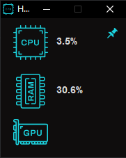

<h1>SysInsight Monitor</h1>

<h2>Bem vindo(ao) meu repositório</h2>

>Status do projeto: Em Desenvolvimento

## Descrição do projeto
 

Este projeto foi desenvolvido com o intuito de exibir informaçoes de desempenho em tempo real da sua máquina, informaçoes como: uso de CPU, uso de memoria ram e futuramente o uso de GPU. Além disso o sistema é simples, instalavél e com uma interface amigável 

    
## Funcionalidades

:heavy_check_mark: `Funcionalidade 1:` exibir informaçoes de uso de CPU, RAM e GPU

:heavy_check_mark: `Funcionalidade 2:` Ficar "transparente" ao clicar no botao de fixar
 

    <h1>Aplicação<h1>
     
     <a href="https://drive.google.com/file/d/1FcvePx2LXekzEV_45VbHzBdvU06ENjR-/view?usp=drive_link">fazer download</a>

            
## Ferramentas utilizadas

 
    
### Você também me encontra em:
&nbsp;&nbsp;
&nbsp;&nbsp;
    
<h2>Guia</h2>

para rodar esse projeto em sua máquina, favor clonar o repositório

Logo após ter clonado(baixado), coloque o projeto em uma unica pasta com o nome "sistema operacional"
